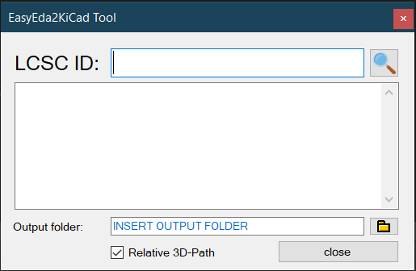

### How to use?

Just open the application an search for the Cxxxx number from LCSC. 
It will then download the full component if existing including 3D-Files, Footprint and Symbols. 
It will place the library where you have specified it using the path. 

#### Hotkey

There is a hotkey. You can use CTRL + E to open up the window.

